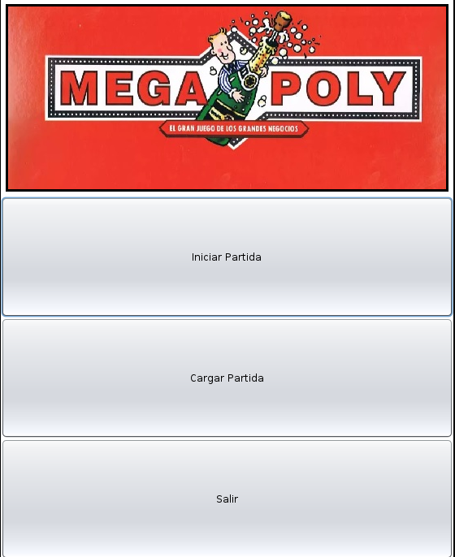
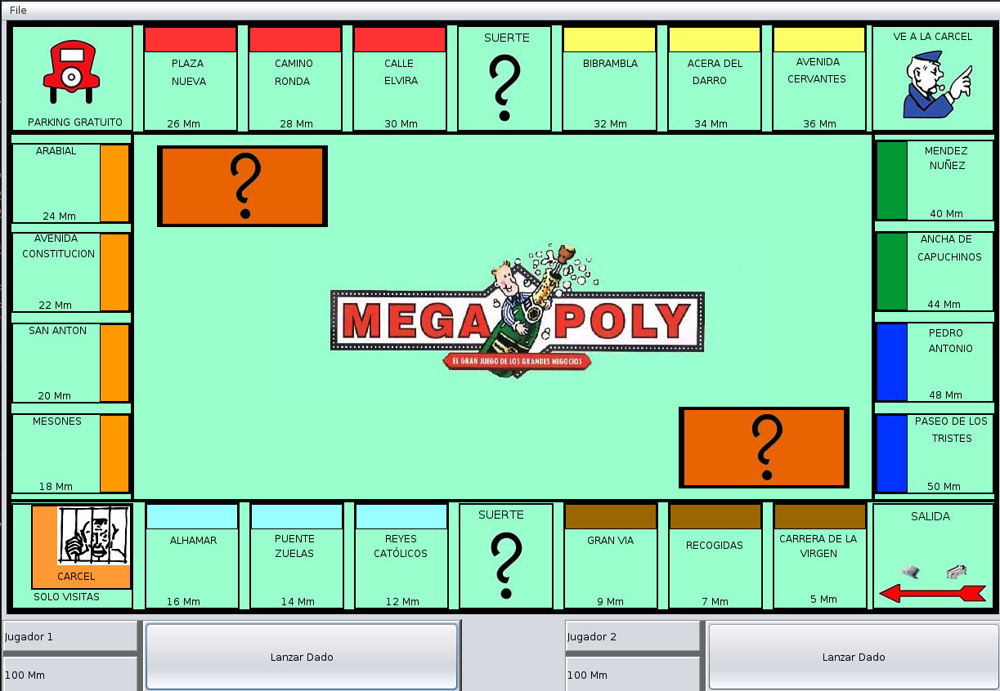

# 🎲 Megapoly 

¡Bienvenido! Este es el **primer proyecto integral** que 
desarrollé como programador. Fue el proyecto final de mi formación inicial y 
representa el momento en el puse en práctica los conocimientos que apredí.

Desarrollar una versión de un juego de tablero tan complejo como el Monopoly fue un reto técnico que me 
obligó a entender a fondo la lógica de negocio y la gestión de estados.

### Detalles Técnicos
* **Lenguaje:** 100% Java.
* **Interfaz Gráfica:** Desarrollada íntegramente con la librería **Swing** (JFrame, JPanel, Graphics).
* **Paradigma:** Programación Orientada a Objetos (POO).

### Imágenes

  

    

###  Console 
1. ** **
2. ** ** 
3. ** **
4. ** ** 

###  Próximos pasos (Mejoras pendientes)
Como proyecto de aprendizaje, todavía tiene mucho margen de crecimiento. Me gustaría mejorar:
* **Animaciones:** Añadir movimiento visual a los dados.
* **Sistema de Hoteles:** Implementar la lógica para subir de nivel las propiedades de casas a hoteles.
* **Visualización de compras:** Crear pantallas de confirmación más detalladas al adquirir nuevas calles.

